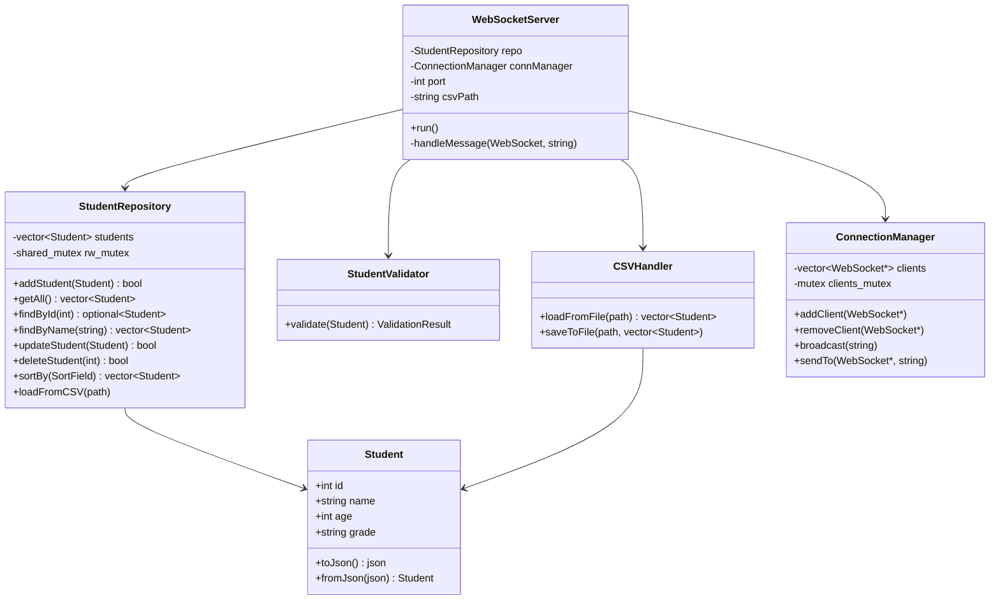
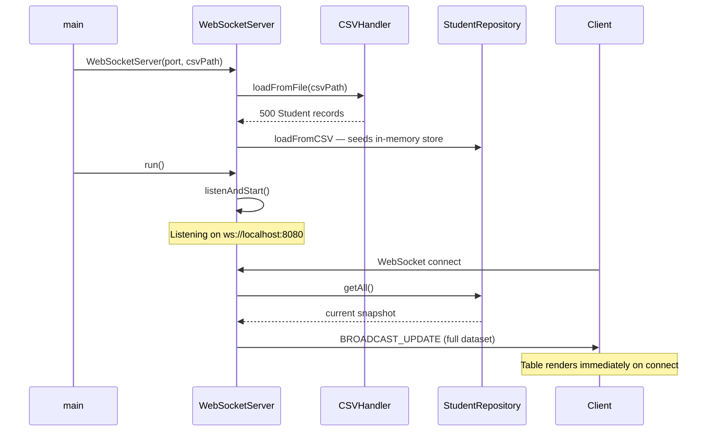
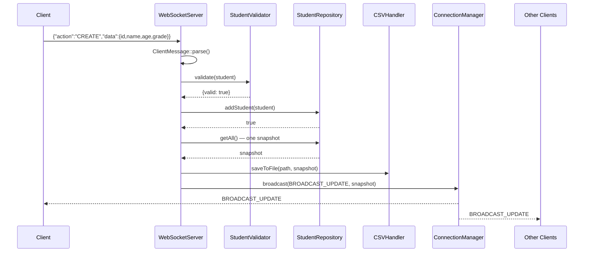

# ScholarDB

A real-time student record system. Add, update, delete, search, and sort student records — changes appear live across every connected client the moment they happen.

---

## Quick Start

**Step 1 — Build**
```bash
make build
```

**Step 2 — Start the server** (keep this terminal open)
```bash
make run-server
```

**Step 3 — Connect a client** (open a new terminal)
```bash
make run-client
```

**Step 4 — Open the browser UI** (optional, works alongside the CLI client)
```bash
make open-browser
```

**Run tests**
```bash
make test
```

> Dependencies (IXWebSocket, Catch2) download automatically on first `make build`. No manual installation needed.

---

## How It Works

Three components, one protocol:

- **Server** — the single source of truth. Loads `students.csv` at startup. Every mutation is saved back to disk and broadcast to all connected clients immediately.
- **CLI Client** — a terminal menu to list, search, add, update, delete, and sort students.
- **Browser UI** — the same operations in a web page. Open multiple tabs — they all update live.

The server treats CLI clients and browser tabs as peers. Both speak the same JSON protocol over WebSocket. A change made from one client instantly appears in all others.

---

## Architecture

### Class Diagram



### Startup Sequence



### CREATE Sequence



> If validation fails or the ID already exists, the server replies with `{"action":"ERROR","message":"..."}` to the sender only — no broadcast, no file write.

---

## Languages & Libraries

| | |
|---|---|
| C++17 | Server and CLI client |
| HTML / CSS / JavaScript | Browser UI — no frameworks, single file |
| [IXWebSocket v11.4.5](https://github.com/machinezone/IXWebSocket) | WebSocket library |
| [nlohmann/json v3.11.3](https://github.com/nlohmann/json) | JSON parsing |
| [Catch2 v3.5.2](https://github.com/catchorg/Catch2) | Unit testing |

---

## Bonus Features

- **Live multi-client broadcast** — every mutation is instantly pushed to all connected clients (browser tabs + CLI)
- **Read-only query isolation** — LIST / SEARCH / SORT reply only to the requesting client, never broadcast
- **Thread-safe concurrent access** — `std::shared_mutex` in the repository; multiple clients can read simultaneously
- **Duplicate ID rejection** — creating a student with an existing ID returns an error immediately
- **Case-insensitive search** — searching "alice" matches "Alice Johnson"
- **Non-destructive sort** — sorting returns a copy; the original insertion order is never changed
- **RAII performance timers** — five operations instrumented; stats print automatically when the server stops
- **Structured logging** — every connect, disconnect, CRUD operation, and error is timestamped to stdout
- **Unit tests** — 22 tests / 79 assertions (CSV round-trip, validator, repository CRUD, concurrency)

---

## Performance

Measured on Apple M-series, loopback, 500-student dataset, 2 connected clients. Press Ctrl-C on the server to see live numbers.

| Operation | Avg (µs) | Notes |
|---|---|---|
| CSV load | 1650 | Once at startup |
| Sort | 241 | Returns a sorted copy — original order unchanged |
| CSV save | 381 | Full file rewrite on every mutation |
| WebSocket transmit | 496 | Per client, per send (500-record payload) |
| Broadcast | 996 | Full loop over all connected clients |

`csv_load` runs once. All per-request operations complete in under 1 ms at this scale.
